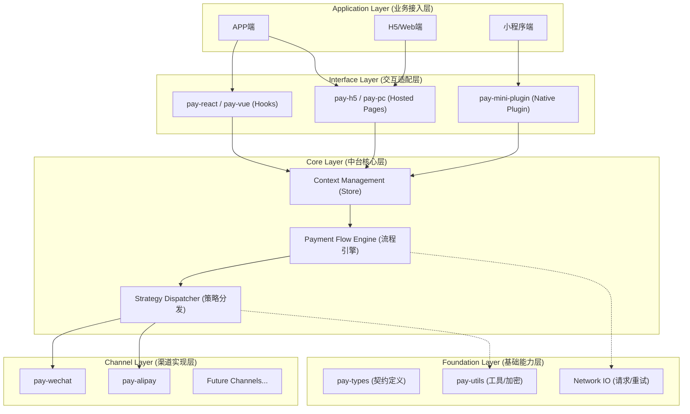

# 支付中台建设规划方案

> **版本**：v1.0.0 | **状态**：规划中 | **维护者**：支付架构组

## 项目背景与战略愿景

### 现状与痛点

随着公司业务生态的跨越式发展，支付收银场景已从单一模式演变为覆盖 **APP、H5、小程序、PC** 的全渠道布局。当前各业务线“烟囱式”独立构建收银台的模式，正在成为制约业务快速迭代的瓶颈：

- **研发资源内耗**：各业务线重复开发支付连接器，导致研发资源严重浪费。
- **维护成本高昂**：面对监管合规调整或渠道接口升级（如微信/支付宝API变动），需多团队、多代码仓库同步变更，响应周期长，风险扩散。
- **用户体验割裂**：各端收银台 UI/UX 风格不统一，缺乏品牌一致性，且难以统一落地精细化的运营策略（如营销立减、支付引导）。

### 战略目标

启动“支付中台”建设项目，旨在构建一套 **标准化、可插拔、高可用** 的企业级支付基础设施，实现以下核心价值：

- **能力收敛与复用**：将支付核心逻辑下沉至中台 SDK，实现“逻辑原子化，服务服务化”。
- **UI 与逻辑解耦**：彻底分离 UI 展现层与支付逻辑层，支持高度定制化 (Theming) 与 Headless 模式接入。
- **全渠道统一适配**：一套核心代码，智能适配 PC、H5、iOS/Android 及各类小程序平台，实现 **Build Once, Run Everywhere**。
- **极速接入体验**：将接入时长从“周级别”降低至“小时级别”，实现“一次接入，全网通用”。

---

## 总体架构设计

### 技术栈选型

采用业界领先的前端工程化体系，确保基础设施的长期演进能力与稳定性。

- **Monorepo 架构**：`PNPM` + `Turborepo`，实现多包管理与构建缓存优化。
- **版本与发布**：`Changesets`，实现自动化语义化版本控制与 Changelog 生成。
- **类型安全**：`TypeScript`，全链路类型约束，降低运行时错误。
- **构建工具**：`Vite` / `Rollup`，追求极致的构建速度与产物优化。

### 架构分层图

### 产品矩阵

| 模块名称            | 类型     | 定位与职责                                                                 |
| :------------------ | :------- | :------------------------------------------------------------------------- |
| **pay-core**        | Kernel   | **[核心]** 纯逻辑内核，无 UI 依赖。负责流程编排、状态管理、策略调度。      |
| **pay-types**       | Contract | **[契约]** 统一接口定义 (Interface)、枚举 (Enum) 与类型声明。              |
| **pay-utils**       | Shared   | **[工具]** 公共工具库，含参数签名、金额格式化、环境嗅探等。                |
| **pay-react/vue**   | Adapter  | **[适配器]** 框架适配层，提供 `Hooks` (usePayment) 与 `Context Provider`。 |
| **pay-h5/pc**       | Product  | **[成品]** 托管式收银台 (Hosted Payment Page)，URL 接入，开箱即用。        |
| **pay-mini-plugin** | Product  | **[插件]** 微信/支付宝小程序原生插件，突破 WebView 限制。                  |
| **pay-wechat/ali**  | Strategy | **[渠道]** 具体支付渠道的 SDK 实现，按需加载 (Tree-shaking)。              |

---

## 核心产品与关键特性

### 核心内核 (pay-core & pay-types)

作为中台的基石，Core 层定义了系统的“骨架”。

- **标准化定义**：显性定义 `SDKConfig`、`PaymentChannel`、`PaymentError` 等核心模型，确保上下游认知一致。
- **流程引擎**：内置支付状态机，标准化处理 `Pending` -> `Processing` -> `Success/Fail` 的生命周期，自动处理轮询 (Polling) 查单逻辑。

### 框架适配器 (pay-react / pay-vue)

为现代前端框架提供“零摩擦”的接入体验。

- **依赖注入**：通过 `Provider` 模式注入环境配置，子组件任意位置通过 `useCashier()` 获取支付能力。
- **Headless UI**：仅提供逻辑 Hook，业务方可完全自定义 UI，也可以直接使用内置的默认 UI 组件。

### 托管式收银台 (Hosted Page: pay-h5 / pay-pc)

**“URL 即服务”**。为业务方提供完全托管的收银台页面，并结合 **PayToken** 机制保障跨域安全。

#### 核心优势

- **零维护成本**：业务方无需更新 npm 包，中台统一发布，新特性与样式迭代即时生效（SaaS化体验）。
- **沙箱隔离**：核心支付逻辑运行在独立域名下，避免业务方代码干扰，提升安全性。
- **动态干预能力**：
  - **灰度发布**：支持基于 `payToken` 或 `userId` 的流量路由，低风险测试新版收银台。
  - **全局熔断**：遇渠道故障或系统维护时，可全局下发公告或切换备用通道，业务方无感知。

#### 核心机制：票据化支付

为解决托管页面的跨域鉴权与安全性问题，建立基于 **PayToken** 的票据交换机制：

- **令牌生成**：业务后端调用中台 OpenAPI，用 `orderId` + `amount` 换取临时票据 `payToken` (5min有效)。
- **SDK 初始化**：业务前端携带 `payToken` 初始化 SDK (或跳转收银台 URL)。
- **收银台鉴权**：SDK 内部用 `payToken` 向中台换取敏感的订单详情 (不透传敏感数据给业务前端)。
- **支付发起**：所有后续支付请求头均携带认证信息，确保链路安全。

### 小程序原生插件 (pay-mini-plugin)

针对小程序“强沙箱”环境的特攻方案。

- **优势**：直接调用 `wx.requestPayment` 等原生能力，无白屏，体验流畅；插件内请求自动加入白名单，业务方**无需配置业务域名**。
- **挑战**：需应对微信严格的插件审核机制与类目资质要求。

---

## 实施路线图

### 阶段 1: 奠基 (Foundation / MVP)

**目标**：跑通核心链路，验证架构可行性。

- **交付**：`pay-types` (契约), `pay-core` (内核)。
- **关键点**：磨平微信/支付宝的入参差异，确立统一的数据输入输出规范。

### 阶段 2: 桥接与体验 (DX Improvement)

**目标**：降低接入成本，提供现代化的开发体验。

- **交付**：`pay-react`, `pay-vue` (Hooks & Providers)。
- **关键点**：确立 API 边界，提供完善的 TypeScript 类型提示，编写开发者文档 (Draft)。

### 阶段 3: 统一收银台 (Unified Cashier)

**目标**：回收 UI 控制权，提供“傻瓜式”接入方案。

- **交付**：`pay-h5`, `pay-pc`, `pay-mini-plugin`。
- **关键点**：实现可视化配置（主题色、Logo），解决跨域登录态同步（PayToken 落地）。

### 阶段 4: 极致性能与解耦 (Optimization)

**目标**：包体积优化与渠道扩展能力建设。

- **交付**：`pay-wechat`, `pay-alipay` 独立拆包。
- **关键点**：引入 **Tree-shaking** 机制，确保业务方仅引入所需渠道代码；支持动态按需加载策略 SDK。

---

## 五、 非功能性需求与风险保障

### 5.1 安全性

- **数据脱敏**：所有敏感信息（如卡号、身份证）在前端仅做掩码展示。
- **防篡改**：核心参数引入签名机制 (Sign)，防止中间人攻击。
- **环境嗅探**：严格校验 `UA` 与环境指纹，防止在非信赖环境中唤起支付。

### 5.2 稳定性与容灾

- **多级降级**：当某一支付渠道不可用时，自动隐藏该选项或引导至聚合支付页。
- **全链路埋点**：内置 `Logger` 插件，自动上报“发起-唤起-回调”各阶段成功率，建立 P0 级监控看板。
- **断网重连**：核心支付请求具备幂等重试机制。

### 5.3 风险评估

- **审核风险**：小程序插件审核通过率存在不确定性。 -> **对策**：同步开发 H5 降级方案。
- **兼容性风险**：Android 碎片化环境下的唤起兼容性。 -> **对策**：建立真机测试实验室，覆盖 Top 20 机型。
